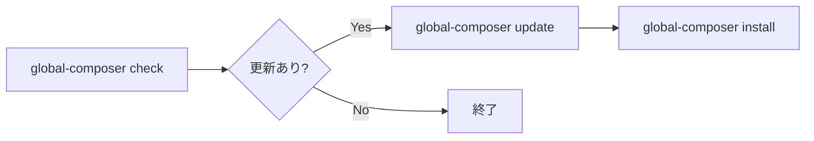

# 📦 Global Composer Package Setup

[](https://www.gnu.org/licenses/gpl-3.0.en.html)
[](https://www.php.net/)
[](https://getcomposer.org/)
[](https://nodejs.org/)
[](https://www.apple.com/os/macos/)
[](https://www.microsoft.com/windows/)

PHP / Composer の **グローバル Composer パッケージ管理** を `composer.json` で一元化する CLI です。
macOS、Windows 11で同じ `global-composer` フローを使えます。

[Global npm Setup](https://github.com/stein2nd/global-npm-setup) の Composer 版リファレンス実装です。

GitHub: [stein2nd/global-composer-setup](https://github.com/stein2nd/global-composer-setup)

## 想定環境

本ツールは、下記に挙げる、PHP、Composer、Node.js が利用でき、Composer のグローバルインストールが許容される環境での利用を想定します。

* macOS (Intel / Apple Silicon)
* Windows 11
* Ubuntu Developer Workstation

下記環境は、推奨外とします。

* 本番サーバー
* AWS Lambda
* 共有ホスティング

## コマンド

```
global-composer check    # グローバルパッケージの更新確認 (composer check-updates --dry-run)
global-composer update   # 実効 composer.json のバージョン制約を更新 (CCU)
global-composer install  # require を列挙して Composer global project に入れる
global-composer sync     # upstream + user-deps → 実効 composer.json を再生成
global-composer add      # user-deps.json にパッケージを追記
global-composer list     # global にインストール済み pkg を一覧 (composer global show)
```

定番フローは、下記の順番になるかと思います。なお、`install` 単体では CCU は実行しません。

```sh
global-composer check
global-composer update
global-composer install
```

## global 環境の確認 (`list`)

```sh
global-composer list
```

global にインストール済みのパッケージを一覧します (`composer global show` と同等)。
実効 `composer.json` ではなく、**現在の Composer が指す `$COMPOSER_HOME` 配下** を読みます。
事前 `sync` なしで、定番フローとは独立しています。

出力1行目は `COMPOSER_HOME=…` です。`install` 直後の反映確認、PHP / Composer 切り替え後の home 確認、`check` と実環境の食い違いの切り分けなどに使います。
詳細は [使い方](./docsMod/usage.md#list-global-環境の確認) をご覧ください。

## しくみ

| レイヤ | 場所 | 役割 |
| --- | --- | --- |
| Upstream 正本 | `stein2nd/global-composer` 同梱 `composer.json` | 公式 `require` 一覧 |
| ユーザー overlay | `$SETUP_DIR/user-deps.json` | 追加分、ピン留め |
| 実効 `composer.json` | `$SETUP_DIR/composer.json` | CCU、install が読む実効マニフェスト |

**setup ディレクトリ (`$SETUP_DIR`) のデフォルト**

| OS | パス |
| --- | --- |
| macOS、Linux | `~/.config/global-composer` |
| Windows 11 | `%APPDATA%\global-composer` |

`GLOBAL_COMPOSER_SETUP_DIR` 環境変数で上書きできます。`$SETUP_DIR` は宣言の置き場、`$COMPOSER_HOME` は実環境です。混ぜません。詳細は [docsMod/layout.md](./docsMod/layout.md) をご覧ください。

## セットアップ

`stein2nd/global-composer` は Packagist パッケージとして利用することを推奨します。

### macOS での下準備

Homebrew、PHP v8.3以降、Composer v2.3以降、Node.js v18以降が未導入の場合は、先にインストールしてください。

1. `php -v`、`composer --version`、`node -v` を実行する。
 1. 失敗する場合は、`brew install php composer node` または `nvm install` などで、必要なランタイムをインストールする。
2. `php --version`、`composer --version`、`node --version` でバージョンを確認する。
3. `composer global config bin-dir --absolute` のディレクトリが PATH に入っているか確認する。入っていない場合は、シェル設定に追加する。
4. 移行する場合、`~/bin/global-composer` (Zsh ラッパー) が PATH に残っていないか確認する。残っている場合は削除する (Composer global bin の `global-composer` と競合する場合がある)。

* 推奨配置 (開発): `~/dotfiles/global-composer-setup/`
* setup ディレクトリ: `~/.config/global-composer`
* Composer global bin: `$(composer global config bin-dir --absolute)` (通常 `$COMPOSER_HOME/vendor/bin`)

### Windows での下準備

PHP v8.3以上、Composer v2.3以上、Node.js v18以上 (LTS 推奨) が未導入の場合は、先にインストールしてください。PHP は [php.net](https://windows.php.net/)、scoop、winget のいずれか、Composer は [公式 Windows インストーラ](https://getcomposer.org/download/)、Node.js は [fnm](https://github.com/Schniz/fnm)、[nvm-windows](https://github.com/coreybutler/nvm-windows)、[Volta](https://volta.sh/)、公式インストーラのいずれでもかまいません。

1. `php -v`、`composer --version`、`node -v` を実行する。
 1. 失敗する場合は、上記の経路から PHP、Composer、Node.js をインストールする。
 2. PowerShell で `where.exe php`、`where.exe composer`、`where.exe node` を実行して、各コマンドが正常にインストールされているか確認する。
2. PowerShell でスクリプトの実行権限を `Get-ExecutionPolicy` (勤務先 PC の場合は `Get-ExecutionPolicy -List`) で確認する。
 1. `Restricted` の場合は、`Set-ExecutionPolicy -Scope CurrentUser RemoteSigned` を実行する。
 2. あらためて `Get-ExecutionPolicy` で `RemoteSigned` になっているか確認する。
3. `php --version`、`composer --version`、`node --version` でバージョンを確認する。
4. `composer global config bin-dir --absolute` のディレクトリを PATH に入れる。PowerShell を再起動後、`global-composer check` (導入後) で PATH を確認する。

* 推奨配置 (開発): `%USERPROFILE%\dotfiles\global-composer-setup\`
* setup ディレクトリ: `%APPDATA%\global-composer`
* Composer global project: `%APPDATA%\Composer` (`COMPOSER_HOME` 未設定時)
* Composer global bin: `%APPDATA%\Composer\vendor\bin` (確認は `composer global config bin-dir --absolute`)

### Packagist パッケージの導入

```sh
composer global require stein2nd/global-composer   # CLI 本体の導入 (これは一度だけ)
global-composer check                              # Composer 経由の CCU で動作 (PATH に ccu 不要)
global-composer add friendsofphp/php-cs-fixer:^3.64   # 任意: ユーザー追加分
global-composer install                            # 実効 composer.json の require を global install
```

初回の `global-composer install` で `~/.config/global-composer/` (Windows 11では `%APPDATA%\global-composer\`) に実効 `composer.json` が生成されます。
`global-composer install` は、`stein2nd/global-composer` 自身 (自己参照) も含め、`require` のキーを列挙して Composer global project に入れます (`php` および `ext-*` は除く)。

`$COMPOSER_HOME/vendor/bin` が PATH に入っている必要があります。確認: `composer global config bin-dir --absolute`。

### 開発: リポジトリ clone

```sh
git clone https://github.com/stein2nd/global-composer-setup.git
cd global-composer-setup
npm install
npm run build
composer global config repositories.global-composer-setup path "$(pwd)"
composer global require stein2nd/global-composer:@dev
GLOBAL_COMPOSER_SETUP_DIR=.sandbox/setup global-composer sync
global-composer install
```

## ユーザー追加分の管理

```sh
# 追加分を登録 (constraint 省略時は Packagist で ^x.y.z、失敗時は *)
global-composer add phpstan/phpstan
global-composer add phpunit/phpunit --dev

# マージ結果を確認 (書き込みなし)
global-composer sync --dry-run
```

* upstream (`composer global update stein2nd/global-composer`) 更新後も、ユーザー追加分は消えない。
* upstream 管理パッケージのうち未 update 分は、次回 `check` 時の sync で新 constraint に追従する。
* upstream パッケージをピン留めする場合は、`user-deps.json` の `require` に同名で constraint を書く。

## 使い方

下記については、[使い方](./docsMod/usage.md) をご覧ください。

* 各コマンドの役割 (`check`、`update`、`install`、`add`、`sync`、`list`)
* 定番フロー (`check` → `update` → `install`)
* 毎回 `sync` を実行する必要があるか
* upstream 管理分と追加分の衝突が起こった場合

## 日常の更新サイクル



* **check:** sync 後に CCU で更新候補を表示。CCU 自体は constraint を書き換えない。
* **update:** 実効 `composer.json` の `require`、`require-dev` の constraint を更新。`composer global update` はしない。
* **install:** 実効 `composer.json` の **require** のみ Composer global project に入れる。

## ライセンス

GPL-3.0-or-later: 詳細は [LICENSE](./LICENSE) をご覧ください。
