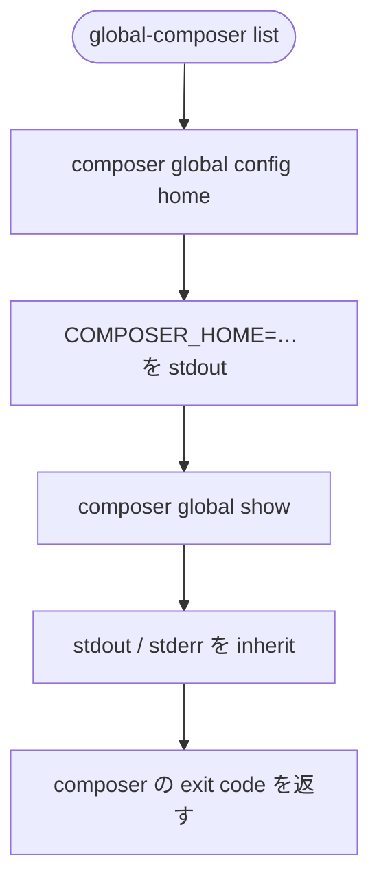

# Global Composer Package Setup - CLI list サブコマンド

`global-composer list` サブコマンドの詳細仕様です。要点は [cli.md](./cli.md) に反映済みです。

## 背景

CLUI は、実効 `composer.json` を起点に **更新確認、constraint 更新、global install** を行うコマンドが中心です。
一方、ユーザーが「いま Composer global に何が入っているか」を確認するには、毎回 `composer global show` を直接実行する必要があります。

`global-composer list` は、この確認を CLUI から提供します。
manifest の内容ではなく、**実際に Composer global project (`COMPOSER_HOME`) に入っているパッケージ** を表示します。

FOP の観点では、`list` はドメイン (マージ) を持たない **読み取り専用アダプタ呼び出し** です。
副作用を起こさないため、`syncManifest()` の前段に置きません。

姉妹 `global-npm list` (`npm ls -g --depth=0`) と同型です。

## 決定事項サマリー

| 項目 | 決定 |
| --- | --- |
| サブコマンド名 | `list` |
| 実装 | `COMPOSER_HOME` を1行目に表示し、`composer global show` を透過実行 (`stdio: 'inherit'`) |
| 事前 `syncManifest()` | **呼ばない** (読み取り専用) |
| 出力 | Composer の標準出力を **そのまま** 表示する (加工やフィルターなし) |
| `COMPOSER_HOME` 行 | **省略しない** (姉妹の prefix 行に相当) |
| 追加引数 | 受け付けない (未知引数は usage → `exit 1`) |
| 定番フロー | **含めない** (`check` → `update` → `install` とは独立) |
| バージョン | v1.0.0時点で契約する |

## 目的と非目的

### 目的

* 現在の PHP / Composer 環境における **global project (`COMPOSER_HOME`)** を示す。
* インストール済みパッケージ一覧を、Composer と同じ形式で確認できる。
* macOS、Windows 11で同一のサブコマンド名を提供する。

### 非目的 (行わない)

* 実効 `composer.json` との差分表示。
* manifest 管理対象のみに絞った一覧。
* Composer 出力の再フォーマット。
* `composer global show` の `--direct` 等オプションの透過。
* Presenter 層での整形 (部分的 Clean Architecture でも、ここは Composer に委譲する)。

`--direct` をデフォルトにしないのは、ユーザー指定の実体が `composer global show` だからです。
絞り込みが必要なら、ユーザーが直接 Composer を実行します。

## `$SETUP_DIR` との関係

| 概念 | パス例 | `list` で示すか |
| --- | --- | --- |
| 実効 manifest | `$SETUP_DIR/composer.json` | 否 (manifest は表示しない) |
| Composer global project | `$COMPOSER_HOME` (例: `~/.composer`、`~/.config/composer`、`%APPDATA%\Composer`) | **是** (1行目) |

`list` は **「global ってどこ ?」** を Composer に委ねて表示します。
`GLOBAL_COMPOSER_SETUP_DIR` の値そのものは出力しません (必要なら別途 `echo $GLOBAL_COMPOSER_SETUP_DIR` 等)。

`COMPOSER_HOME` は環境変数があればそれを使い、なければ `composer global config home` の結果を使います。

## コマンド仕様

### `global-composer list`

| 項目 | 内容 |
| --- | --- |
| 目的 | 現在の Composer global project にインストールされているパッケージを一覧する。 |
| 事前処理 | なし (`syncManifest()` を呼ばない) |
| 実装 | `composer global config home` でパスを得て1行表示し、`spawnSync('composer', ['global', 'show'], { stdio: 'inherit', shell: win32 })` |
| 副作用 | なし (ファイル読み書きなし) |
| exit code | 子プロセス (`composer`) の status をそのまま返す |

Vite 構成でも、application の `handleList` は Composer アダプタを呼ぶだけです。
domain モジュールは使いません。

### 出力例 (macOS)

```
COMPOSER_HOME=/Users/ユーザー名/.composer
friendsofphp/php-cs-fixer 3.64.0 PHP Coding Standards Fixer
stein2nd/global-composer 1.0.0 Manage globally installed Composer packages via composer.json with ccu.
webworkerjoshua/composer-check-updates 1.x.x Interactive dependency update checker for Composer
```

1行目の `COMPOSER_HOME=…` は **省略しません**。
`composer global show` 自体は home を出さないため、姉妹 `npm ls` の prefix 行に相当する情報を CLUI が足します。
中身の一覧は Composer 出力のままです。

### usage への追記

```
Usage: global-composer <check|update|install|sync|add|list>

  check    Check for available updates (composer check-updates --dry-run)
  update   Update version constraints in composer.json (ccu)
  install  Install require into the Composer global project
  sync     Merge upstream + user-deps into materialized composer.json
  add      Add a package to user-deps.json (optional: --dev)
  list     List packages in the Composer global project (composer global show)
```

## 実行フロー



`check`、`update`、`install` と異なり、`resolveSetupContext` 以降の manifest 操作は行いません。
cli はサブコマンド判定のあと、application → Composer adapter に渡します。

## 実装メモ

| 場所 | 方針 |
| --- | --- |
| エントリ | `src/cli` の振り分け → `handleList` |
| Composer 起動 | `src/adapters` の Composer 実行 |
| 新規ドメイン | 不要 |

## 仕様準拠テスト

| ID | 条件 |
| --- | --- |
| CLI-20 | `list` サブコマンドが `composer global show` を spawn すること。 |
| CLI-21 | `list` の実装が `syncManifest` / `prepare` を呼ばないこと (ソース静的確認)。 |
| CLI-22 | `usage` 文字列に `list` が含まれること。 |
| CLI-23 | `list` が `COMPOSER_HOME` を1行目に出すこと。 |

## 実機確認 (任意)

HW-05。OS 別の手順と合否は [test-results.md](./test-results.md) の「実機テスト」節です。

## ステータス

**草案:** 2026-08-15。姉妹 [cli-list.md](https://github.com/stein2nd/global-npm-setup/blob/main/docs/cli-list.md) を踏襲。
