# Global Composer Package Setup - CLI

Global Package Setup シリーズ (Composer 実装) の CLUI 仕様です。

## 位置付け

`global-composer` は **CLUI ユーティリティ** です。対話 TUI や GUI は持ちません。
macOS、Windows 11で同一のサブコマンドを提供します。

初版から **overlay manifest** を採用します。
`check`、`update`、`install` は実効 `composer.json` を操作します ([layout.md](./layout.md))。

install の実装は **C 型 (列挙 → 明示 `composer global require` / `composer global install`)** とします。詳細は [install.md](./install.md) をご覧ください。

内部構造は [specs.md](./specs.md) の方針に従います。

* FOP + Clean Coding (ドメインは純関数、副作用はアダプタ)。
* Clean Architecture のフルセットは使わず、domain / application / adapters / cli の依存の向きだけ借りる。
* ビルドは Vite。公開されるコマンド契約は変えない。

## コマンド一覧

```
global-composer check    # グローバルパッケージの更新確認 (composer check-updates --dry-run)
global-composer update   # 実効 composer.json のバージョン制約を更新 (CCU)
global-composer install  # require を列挙して Composer global project に入れる
global-composer sync     # upstream + user-deps → 実効 composer.json を再生成
global-composer add      # user-deps.json にパッケージを追記
global-composer list     # global にインストール済み pkg を一覧 (composer global show)
```

姉妹 `global-npm` の6サブコマンドと同型です。実体だけを Composer / CCU に置き換えます。

## 各サブコマンドの仕様

### 共通: 事前 sync

`check`、`update`、`install` は実行前に `syncManifest()` を呼び、`$SETUP_DIR/composer.json` (実効 `composer.json`) を最新化します。
`list` は呼びません。

### `global-composer check`

| 項目 | 内容 |
| --- | --- |
| 目的 | 管理対象パッケージに利用可能な更新があるか確認する。 |
| 事前処理 | `syncManifest()` |
| 実装 | CCU を `--working-dir=$SETUP_DIR` で起動し、**`--dry-run`** (必要なら `--format json`) |
| 副作用 | 実効 `composer.json` は sync により更新されうる。CCU 自体は check 時に constraint を書き換えない。 |
| Composer 側の実体 | `composer check-updates --dry-run` |

CCU の対話 picker は使いません (CLUI 契約)。stdout が TTY でなくても一覧が出る非対話モードを使います。
実効 `composer.json` の `require` と `require-dev` の両方を CCU が読みます。

### `global-composer update`

| 項目 | 内容 |
| --- | --- |
| 目的 | 実効 `composer.json` のバージョン制約を、最新に書き換える。 |
| 事前処理 | `syncManifest()` |
| 実装 | CCU の一覧を入力に、実効 `composer.json` の constraint を書き換える (ncu `-u` 相当) |
| 副作用 | 実効 `composer.json` を更新する。`user-deps.json` と upstream 正本は変更しない。**`composer global update` は呼ばない。** |
| Composer 側の実体 | CCU / (必要なら) `$SETUP_DIR` 内の書き換え。global project は触らない |

CCU の `--all` は `composer.json` 書き換えに加えて `composer update` まで走らせます。
`update` サブコマンドの意味論は「宣言 (constraint) だけ新しくする」です。

* 第一候補: CCU `--format json` (または `--dry-run`) の結果を domain が constraint に写し、adapters が実効 `composer.json` を書く。
* `--all` を使う場合は `--working-dir=$SETUP_DIR` に閉じる。`$SETUP_DIR/vendor` は実環境ではない。`composer global update` は **install** の仕事です。

### `global-composer install`

| 項目 | 内容 |
| --- | --- |
| 目的 | 実効 `composer.json` の `require` を **各々 Composer global project のルートパッケージ** として入れる。 |
| 事前処理 | `syncManifest()` |
| 実装 | C 型: 実効 `composer.json` の `require` を読み、platform パッケージを除いて `composer global require vendor/pkg:constraint …` し、必要なら `composer global install` |
| 副作用 | `$COMPOSER_HOME/composer.json`、`vendor/`、`vendor/bin` を更新。 |
| Composer 側の実体 | `composer global install` (列挙の実現手段として `composer global require`) |

`require-dev` は install 対象外です ([install.md](./install.md))。
`php` および `ext-*` は列挙しません。

#### 定番フロー

```sh
global-composer check
global-composer update
global-composer install
```

### `global-composer sync`

| 項目 | 内容 |
| --- | --- |
| 目的 | upstream + `user-deps.json` → 実効 `composer.json` を再生成する。 |
| 実装 | `syncManifest()` |
| 副作用 | `$SETUP_DIR/composer.json` と `.upstream-meta.json` を更新。 |
| オプション | `--dry-run`: ファイル書き込みなし。差分を stderr に表示。 |
| Composer 側の実体 | なし (マージのみ)。`composer global` は呼ばない |

CCU、`composer global` は呼びません。マージ判断そのものはドメインの純関数です。
姉妹と同じく、**sync はマニフェストの合成** であり、実環境 (`COMPOSER_HOME`) の同期ではありません。実環境は `install` です。

### `global-composer add <vendor/pkg>[:constraint] [--dev]`

| 項目 | 内容 |
| --- | --- |
| 目的 | `user-deps.json` にパッケージを追記し、sync する。 |
| `--dev` | `require-dev` に追加 (省略時は `require`)。 |
| constraint 省略 | Packagist / `composer show vendor/pkg --available` → `^x.y.z`。失敗時は `*` にフォールバック。 |
| 副作用 | `user-deps.json` 更新 → `syncManifest()`。自動 `install` はしない。 |
| Composer 側の実体 | `composer global require` 相当 (ただし add 時点では global project に入れない) |

パッケージ名は `vendor/package` 形式です (`/` 必須)。

```sh
global-composer add friendsofphp/php-cs-fixer:^3.64
global-composer add phpstan/phpstan --dev
global-composer add squizlabs/php_codesniffer   # 最新版から ^x.y.z を自動設定
```

### `global-composer list`

| 項目 | 内容 |
| --- | --- |
| 目的 | 現在の Composer global project にインストールされているパッケージを一覧する。 |
| 事前処理 | なし (`syncManifest()` を呼ばない) |
| 実装 | `COMPOSER_HOME` を1行目に出し、`composer global show` を透過実行 (`stdio: 'inherit'`) |
| 副作用 | なし |
| exit code | 子プロセス (`composer`) の status をそのまま返す |

`COMPOSER_HOME` 行は省略しません (PHP / Composer の切り分けに必要)。
定番フロー (`check` → `update` → `install`) には含めません。詳細は [cli-list.md](./cli-list.md) をご覧ください。

## CLUI 実装

### レイヤ分担 (部分的 Clean Architecture)

| レイヤ | 責務 | 例 |
| --- | --- | --- |
| cli | argv の解釈、usage、exit code | 未知サブコマンド → usage → `exit 1` |
| application | サブコマンド相当のユースケース関数 | `handleCheck`、`handleInstall` |
| domain | 純関数 | `mergeRequire`、`parseAddSpec` |
| adapters | fs、spawn、パス、CCU / Composer 起動 | `readJson`、`runCcu`、`runComposer` |

フルセットの Controller / Presenter / Gateway クラスは置きません。
CLUI なので「表示」は stdout / stderr の `inherit` か、短いメッセージにとどめます。

### ツールチェイン

| 項目 | 方針 |
| --- | --- |
| 言語 | TypeScript。Vite が Node 向けにビルド |
| エントリ | `src/cli/main.ts` → `dist/global-composer.js` (Composer `bin` が指す) |
| ライブラリ | `src/domain`、`src/application`、`src/adapters` |
| shebang | `#!/usr/bin/env node` をビルド成果に付与 |
| 引数解析 | サブコマンド6つ。未知の引数は usage 表示して `exit code: 1`。CLI フレームワークは必須にしない |
| 子プロセス | adapters に閉じる。Windows では `shell: true` (`composer.bat`) |
| JSON 処理 | `fs` + `JSON.parse` (**jq 不要**) |

### usage

```
Usage: global-composer <check|update|install|sync|add|list>

  check    Check for available updates (composer check-updates --dry-run)
  update   Update version constraints in composer.json (ccu)
  install  Install require into the Composer global project
  sync     Merge upstream + user-deps into materialized composer.json
  add      Add a package to user-deps.json (optional: --dev)
  list     List packages in the Composer global project (composer global show)
```

## setup ディレクトリの解決

| 項目 | 内容 |
| --- | --- |
| upstream 正本 | パッケージ root の `composer.json` |
| 実効 `composer.json` | `$SETUP_DIR/composer.json` |
| デフォルト `$SETUP_DIR` | `~/.config/global-composer`。Windows 11では `%APPDATA%\global-composer` |
| 上書き | `GLOBAL_COMPOSER_SETUP_DIR` |
| 実環境 | `$COMPOSER_HOME` (`composer global config home`)。setup とは別 |

パス解決は環境に依存するため **adapters** に置きます。
返る `SetupContext` はイミュータブルなプレーンオブジェクトです。

```ts
const setupDir = path.resolve(
  process.env.GLOBAL_COMPOSER_SETUP_DIR?.trim() || defaultSetupDir(),
);
```

## サブコマンド実行フロー

詳細なシークェンス図は [overlay-manifest.md](./overlay-manifest.md#サブコマンド実行フロー) をご覧ください。

```mermaid
flowchart TD
  START([global-composer 起動]) --> CTX[resolveSetupContext]
  CTX --> SW{subcommand}
  SW -->|check、update、install| PREP[prepare → syncManifest]
  PREP --> ACT[CCU または composer global require / install]
  SW -->|sync| SYNC[syncManifest]
  SW -->|add| ADD[resolveConstraint → user-deps → syncManifest]
  SW -->|list| LIST[COMPOSER_HOME 表示 + composer global show]
```



`list` 以外は application が domain (merge) と adapters (I/O) を組み合わせます。
`list` は読み取り専用のため、manifest ドメインを通さず Composer アダプタだけを呼びます。

## 置かないもの

| 置かない | 代わり |
| --- | --- |
| `~/bin/global-composer` (Zsh) | Composer global `bin` |
| `install-global.zsh` | `global-composer install` |
| jq 列挙 | C 型列挙 |
| CCU の対話 TUI を本 CLUI の UI にする | `--dry-run` / JSON |
| `$SETUP_DIR` を `COMPOSER_HOME` にする | 二層を分離 |

`composer.json` の `scripts` は開発・デバッグ用として残してもよいが、ユーザー向け入口は CLUI に一本化します。

## 関連ドキュメント

* [specs.md](./specs.md): FOP と部分的 Clean Architecture
* [cli-list.md](./cli-list.md): `list` の詳細
* [install.md](./install.md): C 型 install
* [overlay-manifest.md](./overlay-manifest.md): マージと実行フロー
* [layout.md](./layout.md): `$SETUP_DIR` とソース配置

## ステータス

**草案:** 2026-08-15。姉妹 [cli.md](https://github.com/stein2nd/global-npm-setup/blob/main/docs/cli.md) を踏襲。
