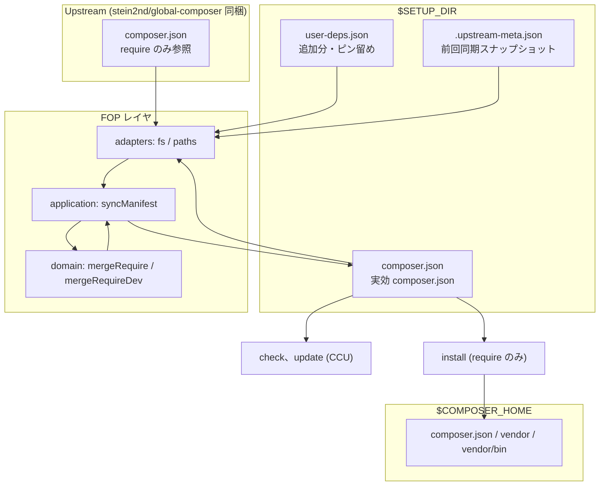
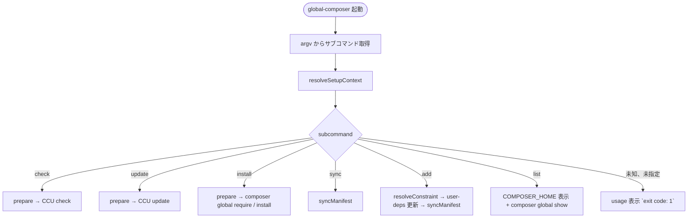
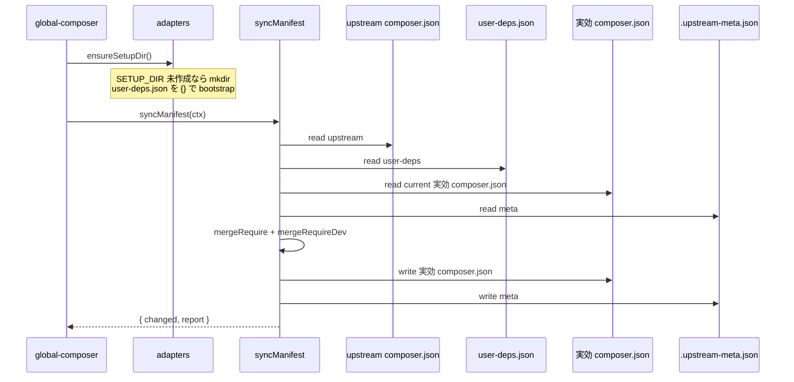
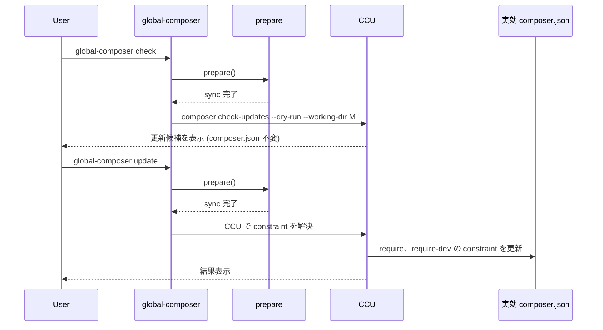
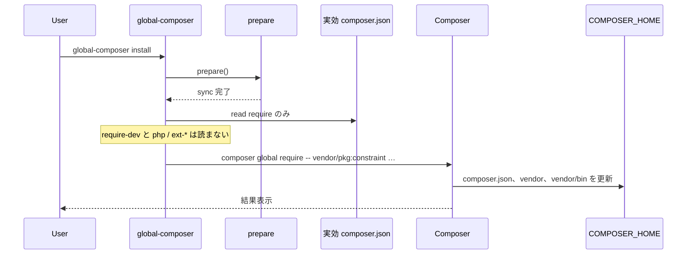
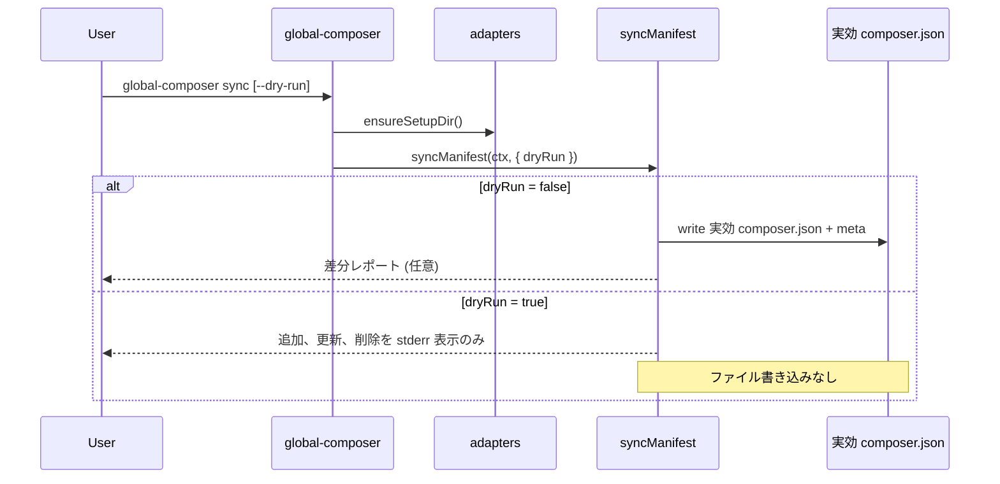
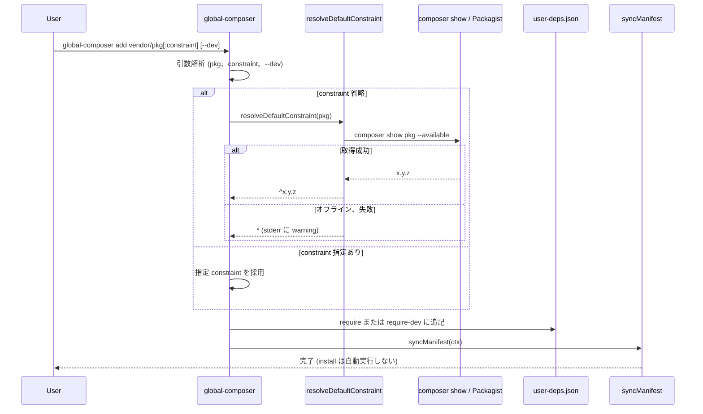
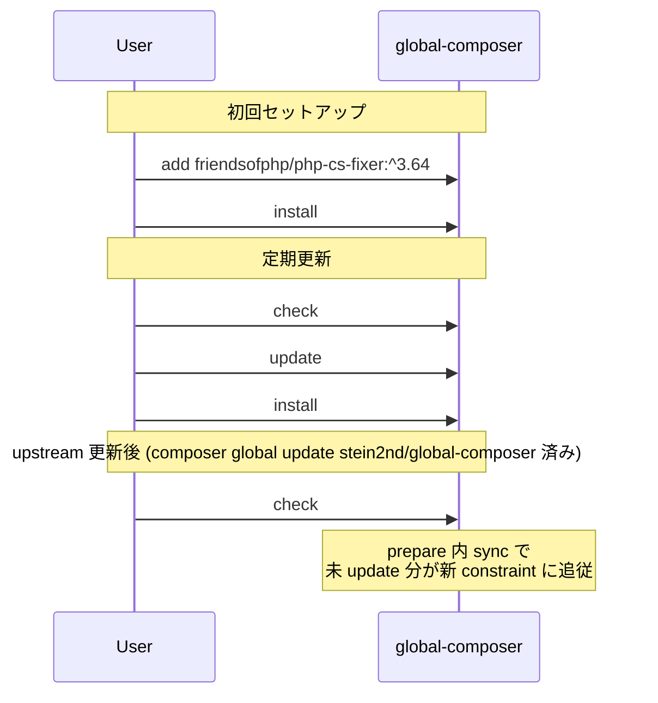

# Global Composer Package Setup - Overlay Manifest (方式 B)

**方式 B (overlay manifest)** の詳細仕様です。要点は [layout.md](./layout.md)、[cli.md](./cli.md)、[install.md](./install.md) に反映済みです。

マージ規則は **ドメインの純関数** として固定します。FOP / Vite 実装でも入出力契約は変えません。
姉妹 [overlay-manifest.md](https://github.com/stein2nd/global-npm-setup/blob/main/docs/overlay-manifest.md) の優先順位を、Composer 語彙 (`require` / `require-dev`) に写します。

## 背景

姉妹 npm 実装の v2.0.x は方式 A (パッケージ同梱のみ) でした。v2.1で方式 B に移行しています。
本プロジェクトは最初から方式 B を採り、次を同時に満たします。

* 利用側が希望する Composer パッケージを global に追加できる。
* upstream (`stein2nd/global-composer`) が `require` を更新しても、利用側の追加分は消えない。
* upstream 更新時、利用側が未 update の upstream 管理パッケージは新 constraint に追従する。
* 勤務先のみ別 pkg 集合にしたい要件に対応する。

## 決定事項サマリー

| 項目 | 決定 |
| --- | --- |
| 方式 | 常時 overlay。同梱 `composer.json` は upstream 正本のみ。 |
| setup デフォルト | macOS、Linux: `~/.config/global-composer`、Windows 11: `%APPDATA%\global-composer` |
| 環境変数 | `GLOBAL_COMPOSER_SETUP_DIR` でデフォルトを上書き可能。 |
| 実環境 | `$COMPOSER_HOME` (Composer global project)。setup とは別。 |
| `require-dev` | **B 案:** `user-deps.json` の `require-dev` を実効 `composer.json` にマージ。`install` は `require` のみ。 |
| upstream `require-dev` | 実効 `composer.json` に含めない (リポジトリ開発用ツールをユーザー環境に流さない)。 |
| `user-deps` による constraint オーバーライト | 可能 (upstream 管理パッケージのピン留め可、最優先)。 |
| upstream から削除 | ユーザー追加分は維持、upstream 管理分は実効 `composer.json` から削除。 |
| サブコマンド | `sync`、`add`、`list` を初版から置く。`list` は overlay を読まない。 |
| `add` の constraint 省略 | オンライン: Packagist / `composer show --available` → `^x.y.z`。オフライン: `*` にフォールバック。 |
| 内部設計 | マージは domain 純関数。I/O は adapters。フルセット Clean Architecture は使わない。 |

## アーキテクチャー全体像



### マニフェストレイヤの役割

| レイヤ | パス | 更新者 | 用途 |
| --- | --- | --- | --- |
| Upstream 正本 | `<packageRoot>/composer.json` | Packagist (Git tag) | 公式 `require` 一覧 |
| ユーザー overlay | `$SETUP_DIR/user-deps.json` | ユーザー、`global-composer add` | 追加分、ピン留め |
| 実効 `composer.json` | `$SETUP_DIR/composer.json` | CLI `sync` | CCU、install の実効マニフェスト |
| Meta | `$SETUP_DIR/.upstream-meta.json` | CLI `sync` | 差分検出用スナップショット |

`packageRoot` は CLUI が属する `stein2nd/global-composer` のインストール先です。

## パス解決

### デフォルト `SETUP_DIR`

| OS | デフォルト |
| --- | --- |
| macOS、Linux | `~/.config/global-composer` |
| Windows 11 | `%APPDATA%\global-composer` (`process.env.APPDATA`、未設定時は `%USERPROFILE%\AppData\Roaming\global-composer`) |

### 解決式

```ts
const setupDir = path.resolve(
  process.env.GLOBAL_COMPOSER_SETUP_DIR?.trim() || defaultSetupDir(),
);
```

パス解決は adapters に置きます。返るコンテキストはイミュータブルなプレーンオブジェクトです。

`GLOBAL_COMPOSER_SETUP_DIR` 未設定時も overlay が有効です。
`$SETUP_DIR` を `$COMPOSER_HOME` のデフォルトにしてはいけません。

## ファイル構成

### `$SETUP_DIR` 一覧

```
~/.config/global-composer/     # または GLOBAL_COMPOSER_SETUP_DIR
├── user-deps.json             # ユーザー追加分、ピン留め
├── composer.json              # 実効 composer.json (CCU、install 入力)
└── .upstream-meta.json        # 同期メタ (Git 管理外、ユーザー環境のみ)
```

### `user-deps.json`

```json
{
  "require": {
    "friendsofphp/php-cs-fixer": "^3.64",
    "squizlabs/php_codesniffer": "^3.11"
  },
  "require-dev": {
    "phpstan/phpstan": "^2.0"
  }
}
```

* 存在しないキーは `{}` として扱う。
* upstream に存在するパッケージ名でも `require` に書けば、**ピン留め** (最優先)。
* 姉妹の `dependencies` / `devDependencies` は使わない。読み込み時に別名を受け付けるかは実装詳細 (デフォルトは受け付けない)。

### `.upstream-meta.json`

```json
{
  "upstreamVersion": "1.0.0",
  "require": {
    "php": ">=8.3",
    "stein2nd/global-composer": "^1.0.0",
    "webworkerjoshua/composer-check-updates": "^1.0"
  },
  "userDeps": {
    "require": {
      "friendsofphp/php-cs-fixer": "^3.64"
    },
    "require-dev": {
      "phpstan/phpstan": "^2.0"
    }
  }
}
```

* `require`: 前回同期時の upstream `require` のコピー。
* `userDeps`: 前回同期時の `user-deps.json` のコピー (`require-dev` の CCU 済み判定に使用)。
* upstream の `require-dev` は記録しない。

### 実効 `composer.json`

```json
{
  "name": "global-composer/user-manifest",
  "description": "Effective Composer global manifest (generated)",
  "require": {
    "php": ">=8.3"
  },
  "require-dev": {}
}
```

`name` は固定値 `global-composer/user-manifest` です。Composer の `vendor/package` 正規表現を満たし、CCU が読める最小構成とします。

## `syncManifest()`: マージ仕様

`check`、`update`、`install`、`sync`、`add` (sync 実行時) の前に呼びます。
初回は `SETUP_DIR` を作成し、空の `user-deps.json` を bootstrap します。

`mergeRequire` / `mergeRequireDev` は引数のオブジェクトだけを見て、新しいオブジェクトを返します (I/O なし)。

### `require` の優先順位 (高い順)

1. `user-deps.json` の `require` にキーがある → その constraint (ピン留め)
2. 実効 `composer.json` の値が前回 upstream と異なる → `global-composer update` 済みとみなし維持
3. それ以外 → 新 upstream の constraint でオーバーライト (未 update 追従)

`php` は例外で、常に `>=8.3` を採用します (ランタイム契約)。

### `require` マージ手順

**フェーズ1: upstream 管理パッケージ**

```
for (name, upstreamConstraint) in upstream.require:
  if name == "php":
    merged[name] = ">=8.3"
    continue

  if name in userDeps.require:
    merged[name] = userDeps.require[name]          // ピン留め
  else if current[name] exists AND meta.require[name] exists
          AND current[name] !== meta.require[name]:
    merged[name] = current[name]                   // CCU update 済み
  else:
    merged[name] = upstreamConstraint              // 未 update → 追従
```

**フェーズ2: upstream にない user 追加分**

```
for (name, constraint) in userDeps.require:
  if name not in upstream.require:
    merged[name] = constraint
```

**フェーズ3: レガシー救済と upstream 削除**

```
for (name, constraint) in current.require:
  if name in merged: continue
  if name == "php": continue

  wasUpstream = name in meta.require
  stillUpstream = name in upstream.require

  if wasUpstream AND NOT stillUpstream AND name not in userDeps.require:
    continue   // upstream 削除 → 実効 composer.json からも削除

  merged[name] = constraint   // ユーザー追加分のみ → 維持
```

### `require-dev` マージ (B 案)

upstream `require-dev` は参照しません。`user-deps.json` の `require-dev` のみが入力源です。

**優先順位**

1. `user-deps.json` の `require-dev` にキーがある → その constraint (ピン留め)
2. 実効 `composer.json` が前回 `meta.userDeps.require-dev` と異なる → CCU update 済みとみなし維持
3. それ以外 → `user-deps` の constraint を採用

**フェーズ3 (レガシー)**

* `current.require-dev` にのみ存在し `user-deps` にないキー → 維持 (移行期間の救済)。
* `user-deps` から削除されたキー → 実効 `composer.json` からも削除。

### sync 後の meta 更新

```
meta = {
  upstreamVersion: upstream.version,  // Packagist / composer.json から得られる版。無ければ tag 相当
  require: { ...upstream.require },
  userDeps: {
    require: { ...userDeps.require },
    require-dev: { ...userDeps.require-dev },
  },
}
```

upstream の `version` フィールドは通常ありません。`upstreamVersion` はインストール済み `stein2nd/global-composer` の版、または `composer.json` extra で渡す値を使います。実装時に adapters が解決します。

### `--dry-run`

`global-composer sync --dry-run` はファイルを書き込まず、追加、更新、削除の差分を stderr に表示します。
dry-run でもマージ純関数は同じ入力で走らせ、ファイルへの書き込みだけ行いません。

## CLUI サブコマンド

### 一覧

```
global-composer <check|update|install|sync|add|list>
```

| サブコマンド | 事前 sync | 操作対象 |
| --- | --- | --- |
| `check` | あり | 実効 `composer.json` → `composer check-updates --dry-run` (`--working-dir=$SETUP_DIR`) |
| `update` | あり | 実効 `composer.json` → CCU で constraint 書き換え。`composer global update` はしない |
| `install` | あり | 実効 `composer.json` の **require のみ** (platform 除く) → COMPOSER_HOME |
| `sync` | — | upstream + user-deps → 実効 `composer.json` |
| `add` | 後続 sync | `user-deps.json` に追記 → sync |
| `list` | **なし** | COMPOSER_HOME の実体 (`composer global show`)。manifest は読まない |

`check`、`update` は実効 `composer.json` の `require` と `require-dev` の両方を CCU が読みます。
`install` は `require` のみとします (`require-dev` は global install しない)。

### `global-composer add <vendor/pkg>[:constraint] [--dev]`

| 引数 | 内容 |
| --- | --- |
| `<vendor/pkg>` | Composer パッケージ名 (`/` 必須) |
| `[:constraint]` | Composer constraint (省略可) |
| `--dev` | `require-dev` に追加 (省略時は `require`) |

**constraint 省略時のデフォルト値**

1. **オンライン (デフォルト):** `composer show vendor/pkg --available` または Packagist API で最新安定版を取得し、`^x.y.z` を設定する。
2. **オフライン、取得失敗時:** `*` にフォールバック。次回 `global-composer check`、`update` で CCU が解決する。

`parseAddSpec` (文字列 → 名前と constraint) は domain の純関数です。
`resolveDefaultConstraint` は Composer / Packagist アダプタを使うため application 側の合成です。

```ts
function resolveDefaultConstraint(packageName: string): string {
  const result = runComposerShowAvailable(packageName); // adapter

  if (result.status === 0) {
    const version = parseLatestStable(result.stdout);
    if (version) {
      return `^${version}`;
    }
  }

  console.error(
    `Warning: could not resolve latest version for ${packageName}; using "*".`,
  );
  return '*';
}
```

* 既存キーがある場合はオーバーライト (ピン変更) とする。
* `add` 完了後に `syncManifest()` を実行する。自動 `install` はしない。
* `vendor/package` 形式でない名前は usage → `exit 1`。

### usage

```
Usage: global-composer <check|update|install|sync|add|list>

  check    Check for available updates (composer check-updates --dry-run)
  update   Update version constraints in composer.json (ccu)
  install  Install require into the Composer global project
  sync     Merge upstream + user-deps into materialized composer.json
  add      Add a package to user-deps.json (optional: --dev)
  list     List packages in the Composer global project (composer global show)
```

## サブコマンド実行フロー

CLUI エントリは `resolveSetupContext()` でパスを解決し、サブコマンドごとに下記フローに分岐します。
この流れは application 関数の呼び出し順として維持します。

### 全体分岐



### 共通: `prepare()`

`check`、`update`、`install` が呼ぶ共通前処理です。



### `check`、`update`



* `check`、`update` は実効 `composer.json` の `require` と `require-dev` の両方を CCU が読む。
* `update` は実効 `composer.json` のみ変更する。`user-deps.json` と upstream 正本は変更しない。
* `update` は `composer global update` を呼ばない。

### `install`



* platform 以外の `require` が空のときは `No packages to install.` で `exit code: 1`。

### `sync`、`sync --dry-run`



* `sync` 単体では CCU、`composer global` は呼ばない。

### `add`



* 既存キーがある場合はオーバーライト (ピン変更)。
* `add` 後の自動 `install` は行わない。ユーザーが `global-composer install` を実行する。

### 定番フロー (ユーザー操作)



## モジュール分割

| 置き場 | レイヤ |
| --- | --- |
| `src/cli/` | cli (argv、usage、エントリ) |
| `src/adapters/` | paths、JSON I/O、Composer / CCU spawn |
| `src/domain/` | `mergeRequire`、`mergeRequireDev`、`parseAddSpec`、`toGlobalInstallSpec`、`isPlatformPackage` |
| `src/application/` | `syncManifest`、`resolveDefaultConstraint`、`handleCheck` 等 |

Entity / Repository / Presenter クラスは置きません。
テストは domain 純関数を優先してユニット化し、adapters は必要なら差し替えます。

## 利用フロー

### 初回セットアップ

```sh
composer global require stein2nd/global-composer
global-composer add friendsofphp/php-cs-fixer:^3.64
global-composer install
```

### upstream 更新後

```sh
composer global update stein2nd/global-composer
global-composer check
global-composer update
global-composer install
```

### ピン留め

`user-deps.json` の `require` に upstream パッケージ名を書くと、upstream 更新後もその constraint を維持します。

## テスト計画

domain 純関数は I/O なしで検証します。ID と期待は姉妹 SYNC-01〜10に対応します。

### マージ (純関数ユニット)

| ID | 観点 | 期待 |
| --- | --- | --- |
| SYNC-01 | user-only `require` | upstream 更新後も維持 |
| SYNC-02 | 未 update の upstream パッケージ | 新 upstream constraint にオーバーライトする |
| SYNC-03 | `global-composer update` 済み | 実効 `composer.json` 維持 |
| SYNC-04 | `user-deps` による upstream ピン | 最優先で維持 |
| SYNC-05 | upstream 削除 (upstream 管理) | 実効 `composer.json` から削除 |
| SYNC-06 | upstream 削除 (user 追加分) | 維持 |
| SYNC-07 | `user-deps.require-dev` マージ | 実効 `composer.json` に反映 |
| SYNC-08 | upstream `require-dev` | 実効 `composer.json` に含まれない |
| SYNC-09 | `user-deps` から require-dev 削除 | 実効 `composer.json` からも削除 |
| SYNC-10 | require-dev の CCU update 済み | 実効 `composer.json` 維持 |
| SYNC-11 | `php` | 常に `>=8.3`。user-deps より優先 |

### constraint 解決

| ID | 観点 | 期待 |
| --- | --- | --- |
| RANGE-01 | `composer show --available` 成功 | `^x.y.z` を返す |
| RANGE-02 | 取得失敗 (オフライン等) | `*` を返し warning を stderr |
| RANGE-03 | `vendor/package` 形式でない | usage → `exit 1` |

### 仕様準拠

CLI-08、LAY-10、CLI-07、CLI-13〜15、LAY-11〜12、CLI-20〜23を姉妹に合わせて置く。
ソースパスが `src/` ですので、静的確認の対象ファイルはそこに置く。

### E2E (`.sandbox/`)

`GLOBAL_COMPOSER_SETUP_DIR=.sandbox/setup` で `sync` → `install` の一連動作を検証します。
E2E の `COMPOSER_HOME` もサンドボックスに向けることを推奨します。

## 関連ドキュメント

* [layout.md](./layout.md): `$SETUP_DIR` とソース配置
* [cli.md](./cli.md): サブコマンド契約
* [specs.md](./specs.md): FOP と部分的 Clean Architecture

## ステータス

**草案:** 2026-08-15。姉妹 [overlay-manifest.md](https://github.com/stein2nd/global-npm-setup/blob/main/docs/overlay-manifest.md) を踏襲。
