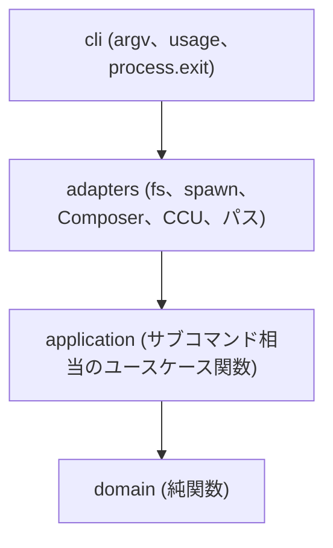

# Global Composer Package Setup - SPECS

確定前の仕様ドキュメントへの導線です。
姉妹 [Global npm Package Setup](https://github.com/stein2nd/global-npm-setup) の `docs/` (2026-08-15確定) を踏襲した **Composer 版リファレンス実装** の草案です。

## シリーズ位置付け

本プロジェクトは **Global Package Setup** シリーズの Composer 実装です。

| 項目 | 内容 |
| --- | --- |
| シリーズ | Global Package Setup |
| 本プロジェクト | Global Composer Package Setup (`global-composer-setup`) |
| Packagist パッケージ | `stein2nd/global-composer` |
| CLUI コマンド | `global-composer` |
| 姉妹プロジェクト | [Global npm Setup](https://github.com/stein2nd/global-npm-setup) (`@s2j/global-npm` / `global-npm`) |
| アプリケーション類型 | **CLUI ユーティリティ** (対話 TUI や GUI ではない) |

シリーズでそろえるものは、次のとおりです。

* グローバルに入れるパッケージ一覧を、マニフェストで管理する。
* 公式一覧 (upstream) と利用側の追加分 (overlay) を分ける。
* OS を問わず、同じサブコマンド体系で鮮度を管理する。
* 仕様は `docs/` を正本とし、改修中は `docsMod/` で草案を置く。

本草案は `docsMod/` に置きます。確定後に `docs/` へ移します。

## 設計方針

姉妹 v2.2の振る舞い契約 (サブコマンド、overlay マージ、C 型 install、`list`) を、Composer 語彙に写して最初から採用します。
このリポジトリに v1シェル時代はないため、機能世代は「姉妹 v2.2相当」、公開バージョンは Packagist 初回を **v1.0.0** とします。

### FOP + Clean Coding

**FOP (関数型オブジェクト指向プログラミング)** を採用します。

* ドメインの判断 (マージ、constraint の解釈、install spec の組み立て) は **純関数** にする。
* 受け渡すまとまりは、クラス階層ではなく **イミュータブルなプレーンオブジェクト** にする (例: setup コンテキスト)。
* 継承や巨大なサービスオブジェクトは使わない。関数の合成で処理を組む。
* 副作用 (ファイル I/O、子プロセス、stdout / stderr) はアダプタに閉じる。

**Clean Coding** と次の点で両立させます。

* 関数は小さく、名前で意図が読めるようにする。
* 関数は1つにつき1責務。抽象度を混ぜない。
* エラーは黙殺せず、exit code と stderr の契約を守る。
* コメントは「なぜ」を書く。仕様の重複コピーは仕様書側に置く。

### Clean Architecture の部分借用

**フルセットの Clean Architecture は採用しません。**
CLUI ユーティリティに、Entity / UseCase / Controller / Presenter / Gateway のクラス一式と DI コンテナは過剰です。

借用するのは、次の依存の向きだけです。

| 借用する | 採用しない |
| --- | --- |
| ドメインを I/O から独立させる | Entity クラス群 |
| サブコマンドをユースケース関数として明示する | Presenter / Controller の機械的分割 |
| I/O をアダプタに寄せ、テストで差し替えやすくする | リポジトリインターフェースの量産 |
| 依存は内側 (domain) に向かわせる | DI コンテナ、フレームワーク非依存のための過剰なポート |

### ビルドツール: Vite

ソースは TypeScript を基本とし、**Vite** で Node.js 向けにビルドします。

| 項目 | 方針 |
| --- | --- |
| ソース | `src/` (TypeScript) |
| 成果物 | `dist/` (CLUI の実行ファイル) |
| `bin` | Composer の `bin` がビルド成果 (またはそれを指すラッパー) を指す |
| 開発用 `package.json` | Node / Vite ツールチェイン専用。upstream 正本ではない |

プラグインの選定 (shebang 付与、外部依存のバンドル範囲) は実装時に決めます。

### アプリケーション類型: CLUI

本ツールは **CLUI (Command Line User Interface) ユーティリティ** です。

* 入口はサブコマンドと引数。対話プロンプトや全画面 TUI は持たない。
* 出力は stdout / stderr と exit code。Composer や CCU の出力は必要な箇所で `inherit` する。
* [Composer Check Updates](https://github.com/webworkerJoshua/composer-check-updates) の対話 picker は使わない。`check` / `update` は非対話フラグで呼ぶ。
* ユーザー向けの操作感は、シリーズ内でコマンド名だけが異なる同型を目指す。

### ランタイムと外部ツール

| ランタイム / ツール | 要求 | 根拠 |
| --- | --- | --- |
| Node.js | **v18以上** (`engines.node`) | 姉妹 Global npm Setup を踏襲。CLUI 本体の実行 |
| PHP | **v8.3以上** | [Composer Check Updates](https://github.com/webworkerJoshua/composer-check-updates) を踏襲 |
| Composer | **v2.3以上** | 同上 (`composer-plugin-api: ^2.3`) |
| Composer Check Updates | 外部ツール (グローバルプラグイン) | `check` / `update` の実体 |
| Composer | 外部ツール | `install` / `add` / `list` および global project 操作 |

CLUI は Node.js 上で動き、PHP / Composer / CCU を **アダプタ経由の子プロセス** として呼びます。

### グローバル環境

実インストール先は **Composer global project** (`COMPOSER_HOME`) です。

| 概念 | 役割 | デフォルト例 |
| --- | --- | --- |
| `$SETUP_DIR` | overlay / 実効マニフェスト | `~/.config/global-composer` |
| `$COMPOSER_HOME` | Composer の global project (実環境) | macOS: `~/.composer` または `~/.config/composer`。Windows: `%APPDATA%\Composer` |

**`$SETUP_DIR` と `$COMPOSER_HOME` は同一にしてはなりません。**
overlay の管理ファイルを Composer の global `composer.json` に混ぜません。
`COMPOSER_HOME` の実体は Composer に問い合わせます (`composer global config home`)。

## ドキュメント命名規則

* **ファイル名:** ASCII のみ (英数字、ハイフン)。日本語やスペースは使わない。
* **タイトル:** 各ファイルの1行目に `# Global Composer Package Setup - …` 形式で記載する。

姉妹の `npm-publish.md` に相当する配布仕様は、本プロジェクトでは **[packagist-publish.md](./packagist-publish.md)** とします。
GitHub の tag / Release を Packagist がクロールする流れに合わせるためです。

## 仕様書一覧

| ファイル | 概要 |
| --- | --- |
| [usage.md](./usage.md) | 使い方 (鮮度管理、`check`、`update`、`install`、`add`、`sync`、`list`) |
| [naming.md](./naming.md) | 命名 (シリーズ、`global-composer-setup`、`stein2nd/global-composer`、`global-composer`) |
| [cli.md](./cli.md) | CLUI サブコマンドとレイヤ分担 |
| [cli-list.md](./cli-list.md) | `list` サブコマンド (`composer global show`) の詳細仕様 |
| [install.md](./install.md) | install 方式 C 型 (列挙 → 明示 `composer global require` / `composer global install`) と CCU 整合 |
| [layout.md](./layout.md) | overlay manifest、`$SETUP_DIR`、`$COMPOSER_HOME`、Vite 前提のリポジトリ構成 |
| [overlay-manifest.md](./overlay-manifest.md) | overlay マージの詳細仕様 (ドメイン純関数) |
| [legacy-scripts.md](./legacy-scripts.md) | シェル入口を置かない理由 (CLUI 一本化) |
| [windows.md](./windows.md) | Windows 11向けセットアップ、制約 |
| [license.md](./license.md) | ライセンス GPL-3.0-or-later |
| [packagist-publish.md](./packagist-publish.md) | Packagist 公開 (`stein2nd` vendor、tag / Release) |

## 姉妹との対応

| 姉妹 (npm) | 本プロジェクト (Composer) |
| --- | --- |
| `@s2j/global-npm` | `stein2nd/global-composer` |
| `global-npm` | `global-composer` |
| `package.json` (`dependencies`) | `composer.json` (`require`) |
| `devDependencies` | `require-dev` |
| ncu (`npm-check-updates`) | CCU (`composer check-updates`) |
| `npm install -g` | `composer global require` / `composer global install` |
| `npm ls -g --depth=0` | `composer global show` |
| npm prefix | `COMPOSER_HOME` |
| `GLOBAL_NPM_SETUP_DIR` | `GLOBAL_COMPOSER_SETUP_DIR` |
| `~/.config/global-npm` | `~/.config/global-composer` |
| npmjs / `npm publish` | Packagist / Git tag |

管理モデル (upstream + user overlay → effective manifest) と6サブコマンドの意味論は、姉妹をそのまま継承します。

## 進行管理

| 種別 | 場所 |
| --- | --- |
| 草案 (本ディレクトリ) | [docsMod/](./) |
| 公開正本 (確定後) | `docs/` (未作成) |

### 仕様書のライフサイクル

1. **草案:** `docsMod/` でリライトする (本作業)。
2. **確定:** 現行の `docs/*.md` があれば `docs/archive/` に移動して freeze する。
3. **公開正本:** リライト確定版を `docs/` に移動する。

## ステータス

**草案:** 2026-08-15。姉妹 [global-npm-setup](https://github.com/stein2nd/global-npm-setup) の `docs/` を踏襲。
